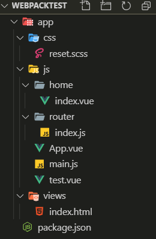

# 从零构建项目（Webpack）


1. 创建项目文件夹webpacktest

2. 在项目目录下执行：

   ```
   npm init
   ```

   得到一个package.json

   然后当然要先安装webpack：

   ```
   npm install webpack -D
   ```

   

3. 创建业务文件：

   

4. 根目录下创建配置文件：webpack.config.js

   1. 基础配置：

      entry/module/plugins/output

      ```js
      const path = require('path');
      
      module.exports = {
        entry: {
          app: './app/main.js'
        },
        module: {
          loader: [{
            test: /\.html$/,
            loader: 'html-loader'
          }, {
            test: /\.vue$/,
            loader: 'vue-loader'
          }, {
            test: /\.scss$/,
            loader: 'style-loader!css-loader!sass-loader'
          }]
        },
        plugins: [],
        output: {
          filename: '[name].min.js',
          //这句话的意思是在当前目录下创建dist目录，然后将filename文件放到dist目录下
          path: path.resolve(__dirname, 'dist')
        }
      }
      ```

      当然了，上面加入的这些loader都要安装：

      ```
          npm install vue-loader style-loader css-loader sass-loader -D
      ```

      

   2. 进阶配置：

      resolve/devtools/dev-server

      - dev-server的使用：可以去官方文档查看它的使用方式，将下面这段代码放在与entry同级：

        ```js
        devServer: {
        //静态资源文件放在哪里
          contentBase: path.join(__dirname, "dist"),
          compress: true,
          port: 9000
        }
        ```

      - 安装 webpack-dev-server：

        ```
        npm install --save-dev webpack-dev-server
        ```

5. 填写文件：

   - reset.scss:

     ```scss
     h1 {
       color: #f00;
     
       .title {
         color: yellow;
       }
     }
     ```

     

   - home/index.vue:

     ```vue
     <template>
       <div class="home">
         <h1>李琳琦<span class="title">我爱你</span></h1>
       </div>
     </template>
     
     <script>
     export default {
     }
     </script>
     
     <style lang="scss">
     .home {
       color: blue;
       .title {
         color: green;
       }
     }
     </style>
     ```

     

   - router/index.js:

     ```js
     import Vue from 'vue'
     import Router from 'vue-router'
     import Home from '../home/index.vue'
     
     Vue.use(Router)
     
     export default new Router({
       routes:[{
         path:'/home',
         name:'home',
         component:Home
       }]
     })
     ```

     当然，不要忘记安装vue和vue-router：

     ```
     npm install vue vue-router
     ```

     

   - App.vue:

     ```vue
     <template>
       <div id="app">
         <router-view></router-view>
       </div>
     </template>
     
     <script>
     export default {
       name: 'app'
     }
     </script>
     
     <style>
     </style>
     ```

     

   - main.js:

     ```js
     import Vue from 'vue'
     import App from './App.vue'
     import router from './router/index.js'
     
     //声明当前不是生产环境
     Vue.config.productionTip = false
     
     new Vue({
       el: '#app',
       router,
       components: {
         App
       },
       template: '<App></App>'
     })
     ```

   - 添加插件：

     ```js
     const HtmlWebpackPlugin = require('html-webpack-plugin');
     const CleanWebpackPlugin = require('clean-webpack-plugin');
     ```

     ```js
       plugins: [
         new CleanWebpackPlugin(['dist']),
         new HtmlWebpackPlugin({
           title: 'Development'
         })
       ],
     ```

     

   - 

